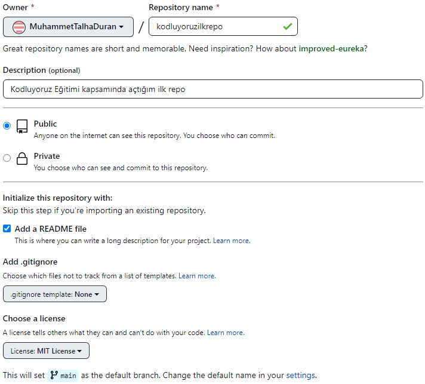

# KOLDUYORUZ ILK REPO
Bu repo kodluyoruz Front-end Eğitiminde oluşturduğumuz ilk repo. İçersinde bir adet README.md ve bir adet index.html dosyası barındırıyor.



## Installation
Öncelikle projeyi klonlayın
```
https://github.com/MuhammetTalhaDuran/kodluyoruzilkrepo.git
```

## Usage
Projeyi klonladıktan sonra Visual Studio Code programını açınız.
```
cd kodluyoruzilrepo
code .
```

## Contributing
Pull requestler kabul edilir. Büyük değişiklikler için lütfen nei değiştirmek istediğinizle ilgili konu açınız.

## Lıcense
[MIT]()